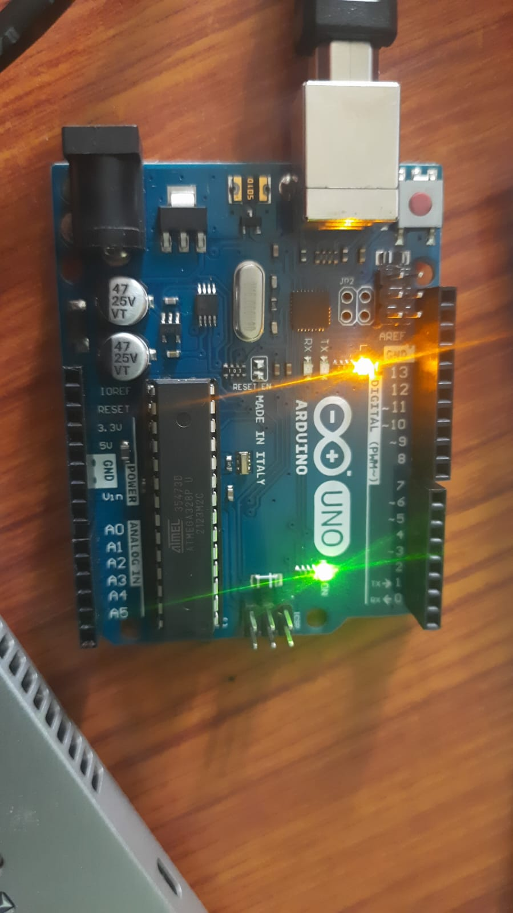

## Programming 

1. For blinking led in the arduino, use the make file to compile the baremetal code into .elf file and then convert to .hex and make flash to flash it into the board 



## For Compilation 
1. avr compiler to convert the .c to .hex or .bin 
```
avr-gcc -mmcu=atmega328p -DF_CPU=16000000UL -Os -o blink.elf example.c
```
2. Convert to .hex
```
avr-objcopy -O ihex blink.elf blink.hex
```

## For Flashing
```
avrdude -c arduino -p atmega328p -P /dev/ttyACM0 -b 115200 -U flash:w:blink.hex
```
or 
```
make flash
```

## For serial monitor 
In linux(ubuntu) check these:
1. Find the port name on which the Arduino is connected to 
```
lsusb 
```
2. Find the port in the /dev/* and check for the port on it
```
ls /dev/ttyACM0
```
3. Connect to arduino using picocom 
```
picocom /dev/ttyACM0 -b 115200
```
4. The picocom prints serial messages 
